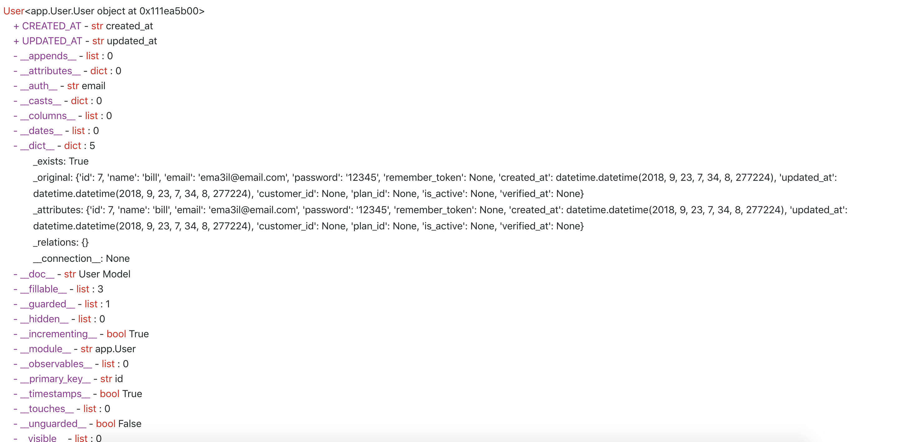

# Helper Functions

## Introduction

Masonite works on getting rid of all those mundane tasks that developers either dread writing or dread writing over and over again. Because of this, Masonite has several helper functions that allows you to quickly write the code you want to write without worrying about imports or retrieving things from the Service Container. Many things inside the Service Container are simply retrieved using several functions that Masonite sets as builtin functions.

These functions do not require any imports and are simply just available which is similiar to the `print()` function. These functions are all set inside the `HelpersProvider` Service Provider.

It may make more sense if we take a peak at this Service Provider:



```python
class HelpersProvider(ServiceProvider):

    wsgi = False

    def register(self):
        pass

    def boot(self, View, ViewClass, Request):
        ''' Add helper functions to Masonite '''
        builtins.view = View
        builtins.request = Request.helper
        builtins.auth = Request.user
        builtins.container = self.app.helper
        builtins.env = os.getenv
        builtins.resolve = self.app.resolve

        ViewClass.share({'request': Request.helper, 'auth': Request.user})
```



Notice how we simply just add builtin functions via this provider.

## Request

The Request class has a simple `request()` helper function.

```python
def show(self):
    request().input('id')
```

is exactly the same as:

```python
def show(self, Request):
    Request.input('id')
```

Notice we didn't import anything at the top of the file, nor did we inject anything from the Service Container.

## View

The `view()` function is just a shortcut to the `View` class.

```python
def show(self):
    return view('template_name')
```

is exactly the same as:

```python
def show(self, View):
    return View('template_name')
```

## Auth

The `auth()` function is a shortcut around getting the current user. We can retrieve the user like so:

```python
def show(self):
    auth().id
```

is exactly the same as:

```python
def show(self, Request):
    Request.user().id
```

This will return `None` if there is no user so in a real world application this may look something like:

```python
def show(self):
    if auth():
        auth().id
```

This is because you can't call the `.id` attribute on `None`

## Container

We can get the container by using the `container()` function

```python
def show(self):
    container().make('User')
```

is exactly the same as:

```python
def show(self, Request):
    Request.app().make('User')
```

## Env

We may need to get some environment variables inside our controller or other parts of our application. For this we can use the `env()` function.

```python
def show(self):
    env('S3_SECRET')
```

is exactly the same as:

```python
import os

def show(self):
    os.environ.get('S3_SECRET')
```

## Resolve

We can resolve anything from the container by using this `resolve()` function.

```python
def some_function(Request):
    print(Request)

def show(self):
    resolve(some_function)
```

is exactly the same as:

```python
def some_function(Request):
    print(Request)

def show(self, Request):
    Request.app().resolve(some_function)
```

That's it! These are simply just functions that are added to Python's builtin functions.

## Die and Dump

Die and dump is a common way to debug objects in PHP and other programming languages. Laravel has the concept of dd\(\) which dies and dumps the object you need to inspect.

`dd()` is essentially adding a break point in your code which dumps the properties of an object to your browser.

For example we can die and dump the user we find:

```python
from app.User import User

def show(self):
    dd(User.find(7))
```

If we then go to the browser and visit this URL as normal then we can now see the object fully inspected which will kill the script wherever it is in place and throw an exception but instead of showing the normal debugger it will use a custom exception handler and show the inspection of the object instead:




